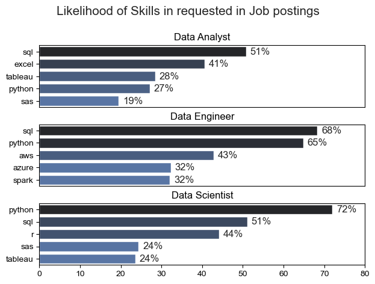
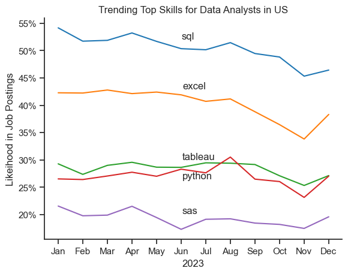
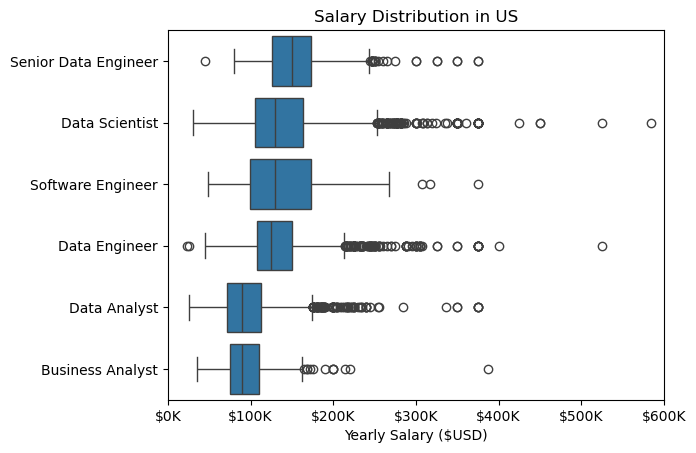
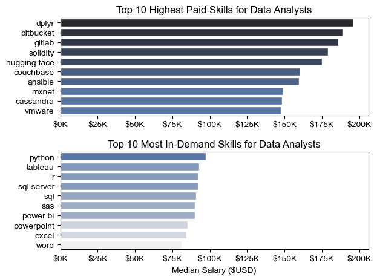
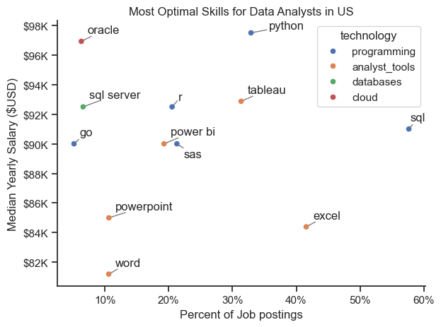

# Overview

As an all time Data enthusiast, who is currently actively looking for opportunities, I wanted to find out more about nature of Data related roles in the job market. This analysis is mainly focused on uncovering useful insights which ultimately is crucial for all existing Data professionals in their decision making and also the new blood who are eager to join this Data job fields, And I'm also happy to share this interesting findings with anyone who are keen on Data related job opportunities.

# Tools I Used

* Python : Main tool used in this analysis including the libraries below.
    * Pandas Library : Used to analyse the data
    * Matplotlib Library : Used for visualizing the data
    * Seaborn Library : Used to generate more advances visualizations
* Jupyter Notebooks : Used to run python scripts including my notes and analysis
* Visual Studio Code : Used to execute python scripts
* Git & Github : Used for version control and esharing my python code and analysis

# Data Preperation and Cleanup

Before conducting the analysis, I carefully prepared the dataset to ensure accuracy and consistency.

* Job posted date was converted from string to datetime format for easy extraction and filtering of data by year, month, day.
* Job skills data is converted from string to a list format which was easily usable for further analysis.

# Background

* Through this project I was keen on finding answers for below questions:

    * 1. What are the most demanded skills for the top 3 most popular data roles?
    * 2. How are in-demand skills trending for Data Analysts?
    * 3. How well do jobs and skills pay for Data Analysts?
    * 4. What is the most optimal skill to learn for Data Analysts?


# The Analysis

## 1. What are the most demanded skills for the top 3 most popular data roles?

To do this, first I filtered out the most popular job titles among all the data job roles and then get the top 5 skills required for each of the job roles. This query can be used as a highlight as for which skills to focus more when applying for each of these specific job title.

View my notebok with detailed steps here:
[2_Skills_demand.ipynb](Project/2_Skills_demand.ipynb)

### Visualize Data

```python
fig, ax = plt.subplots(len(job_titles), 1)

sns.set_theme(style='ticks')

for i, job_title in enumerate(job_titles):
    df_plot = df_skills_percent[df_skills_percent['job_title_short'] == job_title].head(5)
    sns.barplot(data=df_plot, x='skills_percent', y='job_skills', ax=ax[i], hue='skill_count', palette='dark:b_r')
    ax[i].set_title(job_title)
    ax[i].set_xlabel('')
    ax[i].set_ylabel('')
    ax[i].set_xlim(0,80)
    ax[i].legend().set_visible(False)
    
    for n, v in enumerate(df_plot['skills_percent']):
        ax[i].text(v+1, n, f'{v:.0f}%', va='center')
    
    if i != len(job_titles) -1:
        ax[i].set_xticks([])

fig.suptitle('Likelihood of Skills in requested in Job postings', fontsize=15)
fig.tight_layout(h_pad=0.5)
plt.show()
```

### Results



### Insights

#### Common Foundational Skills:

* SQL is critical across all three roles, reflecting its importance in querying, manipulating, and managing databases.

    - Data Analyst: 51%
    - Data Engineer: 68%
    - Data Scientist: 51%

* Python is another essential skill across roles, particularly for Data Engineers and Data Scientists, highlighting its versatility in data analysis, automation, and machine learning.

    - Data Analyst: 27%
    - Data Engineer: 65%
    - Data Scientist: 72%

#### Role-Specific Skills:

:arrow_right: Data Analyst

* Heavy emphasis on SQL (51%), showing the need for managing stuctured data.
* Excel (41%) of job postings highlight Excel as a key tool, indicating the continued importance of spreadsheets for analysis and reporting.
* Tableau (28%) and Python (27%) shown to be equally important for this role.
* SAS (19%) is relevant, but less common, likely due to the growing preference for open-source tools like Python and R.

:arrow_right: Data Engineer

* SQL (68%) of postings highlight SQL, which remains fundamental for managing structured data and building data pipelines.
* Python (65%) of postings list Python as essential, reflecting the role of programming in building, automating, and maintaining data infrastructure.
* AWS (43%), showing the importance of cloud computing skills for managing and storing large-scale data.
* Azure and Spark, (32%), showing that almost one third of the postings has these technologies as a requiremant.

:arrow_right: Data Scientist

* Python (72%) of postings highlight Python, reflecting its critical role in data analysis, machine learning, and statistical modeling.
* SQL (51%) of postings still require SQL for data extraction and manipulation, even in this more advanced role.
* R (44%) of postings require R, a language heavily used in statistical analysis, suggesting a strong need for advanced analytical skills.
* SAS and Tableau, Both at 24%, showing that while these tools are equally useful, they are secondary to Python and R in this role.

#### :memo: Skill Demand summary:

* SQL is crucial across all three roles, particularly for Data Engineers (68%) and Data Analysts (51%), showing it’s a core tool in data management.
* Python is the most in-demand programming language across roles, especially for Data Scientists (72%) and Data Engineers (65%).
* Cloud skills (AWS 43%, Azure 32%) are specifically vital for Data Engineers.
* Visualization tools (Tableau) are more important for Data Analysts (28%) and Data Scientists (24%).


## 2. How are in-demand skills trending for Data Analysts?

Does the demand for highly posted skills always stays the same? This analysis helps us find out. I selected the skills with highest demand and then looked at the likelihood of each skill to appear in job postings over the year. 

View my notebok with detailed steps here:
[3_Skills_trend.ipynb](Project/3_Skills_trend.ipynb)

### Visualise Data

```python
sns.lineplot(data=df_plot, dashes=False, palette='tab10')
sns.set_theme(style='ticks')
sns.despine()

plt.title('Trending Top Skills for Data Analysts in US')
plt.ylabel('Likeihood in Job Postings')
plt.xlabel('2023')
plt.legend().remove()

from matplotlib.ticker import PercentFormatter
ax = plt.gca()
ax.yaxis.set_major_formatter(PercentFormatter(decimals=0))


from adjustText import adjust_text

texts = []
for i in range(5):
    texts.append(plt.text(5, df_plot.iloc[2, i], df_plot.columns[i]))
    
adjust_text(texts)
```

### Results



### Insights

#### SQL Dominance:
* SQL is consistently the most requested skill throughout 2023, starting at around 55% in January and fluctuating between 50% and 55%.
* It shows a gradual decline after the mid-year, dropping below 50% by November but ends with a slight recovery in December.
* This suggests that SQL remains a core competency for Data Analysts, despite minor fluctuations.

#### Stable but Declining Demand for Excel:
* Excel demand remains steady around 40-45% for most of the year.
* It sees a noticeable decline from August to December, finishing the year at approximately 40%, its lowest point.
* While still highly relevant, Excel's decreasing trend suggests the growing importance of other tools in Data Analytics.

#### Moderate Trends for Tableau:
* Tableau fluctuates around 25-30% throughout the year, with a peak in July and August (~30%).
* The tool experiences a slight dip afterward but ends with a small rise in December (~27-28%).
* Tableau’s demand appears to be stable but secondary compared to SQL and Excel, indicating its importance in visualization tasks for Data Analysts.

#### Python Consistency with Small Variations:
* Python exhibits a steady trend, hovering around 25-30% throughout the year, with its highest point in July (~28%).
* Like Tableau, Python sees a small dip towards the end of the year but closes on an upward note in December.
* The stable demand indicates consistent use of Python in analysis tasks, particularly for more technical aspects like data manipulation and automation.

#### Minimal Interest in SAS:
* SAS remains the least requested skill throughout the year, staying below 20%.
* It sees slight increases in May and December, indicating minor trends of increased usage, but overall, SAS demand is diminishing in comparison to other tools.
* This suggests a shift toward more open-source solutions like Python in the Data Analyst field.

#### Seasonal and Comparative Insights:
* SQL and Excel remain dominant, showing that core data management and spreadsheet skills are critical for most Data Analysts.
* Tableau and Python maintain middle-tier demand, indicating the growing need for visualization and programming skills.
* SAS is losing ground compared to the other tools, likely due to the rising popularity of more flexible and open-source alternatives like Python.

#### End-of-Year Recovery for Technical Skills:
* Both Tableau and Python experience a slight rebound in demand towards the end of the year (December), suggesting increased adoption or hiring needs involving technical skills.
* This could indicate a shift in the market's focus towards more technical and automated processes in data analysis as the year progresses.

#### :memo: Skill Trend Summary:
* SQL and Excel remain essential tools but are showing a slight decline in demand, signaling potential changes in the Data Analyst skill landscape.
* Tableau and Python remain critical for analysts who need to engage in data visualization and programming.
* SAS continues to decline in relevance, as open-source alternatives like Python become more preferred.
* The overall trends show a consistent need for data querying, spreadsheet, visualization, and programming skills for Data Analysts, with some shifts indicating the rise of more technical competencies.


## 3. How well do jobs and skills pay for Data Analysts?

### 3.1 Salary Distribution

How different Data Analyst job roles are getting paid? Let's look at the below graph to get an idea about the salary distribution of top 6 job roles.

### Visualize Data

```python
sns.boxplot(data=df_US_Top6, x='salary_year_avg', y='job_title_short', order=job_order)

plt.title('Salary Distribution in US')
plt.xlabel('Yearly Salary ($USD)')
plt.ylabel('')
ax = plt.gca()
ax.xaxis.set_major_formatter(plt.FuncFormatter(lambda x, pos: f'${int(x/1000)}K'))

plt.xlim(0, 600000)
plt.show()
```
### Results



### Insights

#### Median Salaries
* Senior Data Engineers have the highest median salary, followed by Data Scientists and Software Engineers.

#### Salary range
* Software Engineers and Data Scientists show a wider salary range, meaning pay varies a lot depending on experience, company, or location.

* Business Analysts and Data Analysts have a narrower range, suggesting more standardized pay across roles.

#### Outliers (High Salaries)

* All roles, especially Data Scientist, Data Engineer, and Software Engineer, have outliers above $300K, showing opportunities for very high pay at senior or niche levels.

* Senior Data Engineer has fewer extreme outliers but consistently higher base salaries.

#### Entry-Level vs Senior Spread

* Business Analysts and Data Analysts start lower (below $100K) and have less upward growth compared to other roles.

* Software Engineers and Data Scientists not only start higher but also have the potential to move into very high salary brackets.

#### Career Implications

* If someone wants stable, standardized pay, roles like Business Analyst or Data Analyst may be suitable.

* For higher earning potential and growth, Data Science, Data Engineering, or Software Engineering are stronger career paths.

### 2.2 Highest paid data skills

Learning skills is a paramount of important but does it really pay off well in thie end? This analysis helps you find out. I have filtered highest paid skills and also highest demanded skills together with the median salary for a better understanding of the market dyanamics.

View my notebok with detailed steps here:
[4_Salary_analysis.ipynb](Project/4_Salary_analysis.ipynb)

### Visualize Data

```python
fig, ax = plt.subplots(2, 1)

sns.set_theme(style='ticks')

sns.barplot(data=df_DA_Top_pay, x='median', y=df_DA_Top_pay.index, ax=ax[0], hue='median', palette='dark:b_r')

ax[0].set_title('Top 10 Highest Paid Skills for Data Analysts')
ax[0].set_ylabel('')
ax[0].set_xlabel('')
ax[0].xaxis.set_major_formatter(plt.FuncFormatter(lambda x, pos: f'${int(x/1000)}K'))
ax[0].legend().remove()

sns.barplot(data=df_DA_Skills, x='median', y=df_DA_Skills.index, ax=ax[1], hue='median', palette='light:b')

ax[1].set_xlim(ax[0].get_xlim())
ax[1].set_title('Top 10 Most In-Demand Skills for Data Analysts')
ax[1].set_ylabel('')
ax[1].set_xlabel('Median Salary ($USD)')
ax[1].xaxis.set_major_formatter(plt.FuncFormatter(lambda x, pos: f'${int(x/1000)}K'))
ax[1].legend().remove()

fig.tight_layout()
```

### Results



### Insights

#### Highest Paid Skills:

* Skills like dplyr, bitbucket, gitlab,lockchain (solidity) and AI (hugging face) are the most lucrative, with median salaries near $175K-$200K.
* Other specialized skills are offering high pay, highest being couchbase and ansible getting a median salary around ~160K and all other skills ranging around ~$150K-$175K.

#### Most In-Demand Skills:

* Python, Tableau, R and SQL lead the demand for Data Analysts, with median salaries almost up to $100K.
* Powerpoint, Excel and Word still has demand but it's comparatively lower, which shows demand shifting towards new skills.

#### General Trends:

* Niche and highly technical skills correlate with higher salaries.
* Core data analysis tools like Python, Tableau, and SQL remain crucial for demand but offer slightly lower median pay compared to specialized tools.

#### :memo: Salary Analysis summary - Intersection of Demand and Salary:

* It is very evident that highly paid skills are not much in high demand. Therefore level of difficulty is much higher for these jobs. But in case one is able to secure a job is guaranteed that the effort is worth it.
* All top 10 high demand skills pay varies $75K-$100K. So one can also strategize to go for top demanded skills to have a higher chance of getting the ooportunity and also fairly good pay.
* Also, interestingly, a combination of both specialized (e.g., hugging face) and general skills (e.g., Python, SQL) might also maximize a Data Analyst's earning potential.


## 4. What is the most optimal skill to learn for Data Analysts?

Last but not least, all the analysis aside, what's the most optimal skills to learn as a Data Analyst? I have the top skills plotted against the salary and demand which gives us a complete answer to this question.

View my notebok with detailed steps here:
[5_Salary_analysis.ipynb](Project/5_Optimal_skills.ipynb)

### Visualize Data

```python
from adjustText import adjust_text

sns.scatterplot(
    data=df_plot,
    x='skill_percent',
    y='median_salary',
    hue='technology'
)

sns.despine()
sns.set_theme(style='ticks')

plt.title('Most Optimal Skills for Data Analysts in US')
plt.xlabel('Percent of Job postings')
plt.ylabel('Median Yearly Salary ($USD)')
plt.tight_layout()

texts = []
for i, txt in enumerate(df_DA_Skills_high_demand.index):
    texts.append(plt.text(df_DA_Skills_high_demand['skill_percent'].iloc[i], df_DA_Skills_high_demand['median_salary'].iloc[i], txt))
    
adjust_text(texts, arrowprops=dict(arrowstyle="->", color='gray',lw=1), expand=(2,2))

from matplotlib.ticker import PercentFormatter
ax = plt.gca()
ax.yaxis.set_major_formatter(plt.FuncFormatter(lambda y, pos: f'${int(y/1000)}K'))
ax.xaxis.set_major_formatter(PercentFormatter(decimals=0))

plt.tight_layout()    
plt.show()
```
### Results



### Insights

#### High Demand, High Salary:

* Python and SQL show the best combination of demand and salary:
    * Python: High median salary (around $98K) with 35% job postings.
    * SQL: Slightly lower salary (about $90K) but extremely high demand (55% of job postings).

#### Low Demand, High Salary:

* Oracle and SQL Server offer high salaries ($94K-$92K), but their job demand is very low, around 5%.

#### In-Demand Analytical and Programming Tools:

* Excel: High demand (more than 40% of job postings), but lower median salary (~$84K).
* Programming skills like R, and Power BI provide salaries around $90K-$92K range, with moderate demand, around 20% of the postings.


#### Data Visualization Tools:

* Tableau, Balances demand and salary with more than 30% of job postings and a median salary of about $92K.
* Power BI has less demand but still manages to earn around $90K.

#### Lower Demand, Lower Salary:

* PowerPoint and Word are lower-paying skills (around $82K-$85K) with limited demand (under 10% of job postings).

#### :memo: Optimal Skills summary:

* SQL and Python stand out as essential skills for data analysts, offering the best combination of high salary and high demand.
* Data Visualization tools like Tableau and Power BI are also highly relevant, with balanced salary and demand.
* Database management skills such as SQL Server and Oracle offer significant salary benefits despite lower demand.


# Insights

* Python is the top programming language, with high demand for Data Scientists (72%) and Data Engineers (65%).
* SQL is crucial across all roles, especially for Data Engineers (68%) and Data Analysts (51%), highlighting its importance in data management.
* Cloud skills (AWS 43%, Azure 32%) are essential for Data Engineers.
* Visualization tools like Tableau are important for Data Analysts (28%) and Data Scientists (24%).
* SQL and Excel remain critical but are showing a slight decline in demand, suggesting a shift in the Data Analyst skill landscape.
* Tableau and Python are key for data visualization and programming tasks.
* SAS is losing relevance as open-source tools like Python gains preference.
* There’s a growing need for technical skills, but traditional tools like SQL and Excel are still relevant.
* Highly paid skills (e.g., Hugging Face, Couchbase) are less in demand, indicating higher difficulty but better rewards.
* Most in-demand skills offer salaries between $75K-$100K, making these skills a strategic choice for job security and decent pay.
* A combination of specialized and general skills, like Hugging Face, Python, and SQL, could maximize earnings for data analysts.
* SQL and Python are key skills, offering the best balance between high salary and demand.
* Advanced tools like Tableau and Power BI remain relevant with good salary prospects.
* Database skills like SQL Server and Oracle offer high salaries despite lower demand.

# Conclusion

:books: SQL and Python are essential across all data roles, offering the best combination of high demand and salary.

:books: Cloud skills (AWS, Azure) are key for Data Engineers, while visualization tools (Tableau) are important for Data Analysts and Data Scientists.

:books: Traditional tools like SQL and Excel remain relevant but are slowly declining in demand, signaling a shift towards more advanced technical skills.

:books: Highly paid skills (e.g., Hugging Face, Couchbase) are less in demand but offer significant salary rewards, indicating higher job difficulty but better returns.

:books: For a balanced career strategy, focusing on in-demand skills like Python and SQL ensures job security with competitive salaries, while a combination of general and specialized skills maximizes earning potential.